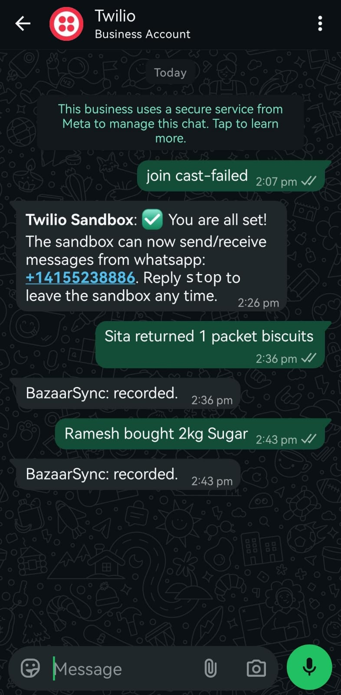
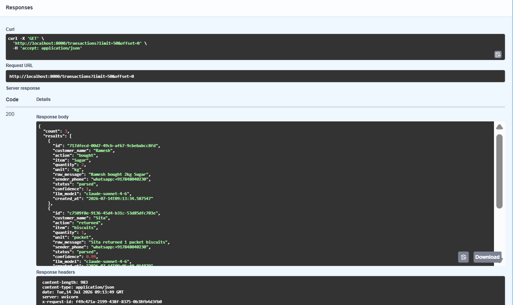

# BazaarSync — WhatsApp → LLM → Structured Data Workflow

Turns free-text WhatsApp shop messages (e.g. *"Ramesh bought 2kg Sugar"*) into structured,
queryable transaction records — parsed by Claude, validated, persisted, logged, and exposed
via a REST API.

**Example:**
```
Input:  "Ramesh bought 2kg Sugar"
Output: {
  "customer_name": "Ramesh",
  "action": "bought",
  "item": "Sugar",
  "quantity": 2,
  "unit": "kg",
  "confidence": 0.97,
  "status": "parsed"
}
```

---

## Architecture

```mermaid
%%{init: {
  "theme": "base",
  "themeVariables": {
    "background": "#050814",
    "fontSize": "27px",
    "primaryTextColor": "#ffffff",
    "lineColor": "#f8fafc"
  },
  "flowchart": {
    "nodeSpacing": 48,
    "rankSpacing": 58,
    "curve": "basis"
  }
}}%%

flowchart LR

    %% =====================================================
    %% 1 · WHATSAPP INTAKE
    %% =====================================================
    subgraph INTAKE[" "]
        direction TB

        H1["📱 1 · WHATSAPP INTAKE"]

        A["👤 Shopkeeper<br/>Ramesh bought 2kg Sugar"]

        B["💬 Twilio WhatsApp<br/>Sandbox / Meta Cloud"]

        C["⚡ FastAPI Webhook<br/>POST /webhook/whatsapp<br/>From · Body"]

        H1 ==> A ==> B ==> C
    end


    %% =====================================================
    %% 2 · AI PARSING
    %% =====================================================
    subgraph PARSE[" "]
        direction TB

        H2["🧠 2 · AI PARSING"]

        D["⚙️ ingest_message()"]

        E["✨ Claude Parser<br/>Anthropic API<br/>Strict JSON Output"]

        F["🧾 Pydantic Validation<br/>ParsedPurchase Schema"]

        H2 ==> D ==> E ==> F
    end


    %% =====================================================
    %% 3 · VALIDATION + STATUS
    %% =====================================================
    subgraph VALIDATE[" "]
        direction TB

        H3["🧪 3 · VALIDATION"]

        G{"🔎 Confidence +<br/>Completeness Check"}

        H["✅ PARSED<br/>Confidence ≥ 0.6<br/>Item Found"]

        I["⚠️ NEEDS REVIEW<br/>Partial Match"]

        J["❌ FAILED<br/>No Match / LLM Error"]

        H3 ==> G

        G ==> H
        G ==> I
        G ==> J
    end


    %% =====================================================
    %% 4 · DATA + API
    %% =====================================================
    subgraph DATA[" "]
        direction TB

        H4["🗃️ 4 · DATA + API"]

        K[("💾 Transactions DB<br/>SQLite / Postgres")]

        L["📋 Structured JSON Logs<br/>request_id Correlated"]

        M["🧑‍💻 API Client<br/>curl · Postman · Dashboard"]

        N["🌐 FastAPI API<br/>GET /transactions<br/>POST /parse · GET /health"]

        M ==> N
        N ==> K
    end


    %% =====================================================
    %% MAIN CROSS-STAGE FLOW
    %% =====================================================
    C ==> D

    F ==> G

    H ==> K
    I ==> K
    J ==> K

    D -.-> L


    %% =====================================================
    %% PREMIUM HEADER STYLES
    %% =====================================================
    classDef intakeHeader fill:#172554,stroke:#60a5fa,stroke-width:5px,color:#ffffff,font-size:30px;

    classDef parseHeader fill:#4c1d95,stroke:#c084fc,stroke-width:5px,color:#ffffff,font-size:30px;

    classDef validateHeader fill:#713f12,stroke:#fbbf24,stroke-width:5px,color:#ffffff,font-size:30px;

    classDef dataHeader fill:#14532d,stroke:#4ade80,stroke-width:5px,color:#ffffff,font-size:30px;

    class H1 intakeHeader;
    class H2 parseHeader;
    class H3 validateHeader;
    class H4 dataHeader;


    %% =====================================================
    %% INTAKE COLORS
    %% =====================================================
    classDef user fill:#172554,stroke:#60a5fa,stroke-width:5px,color:#ffffff,font-size:27px;

    classDef whatsapp fill:#075985,stroke:#22d3ee,stroke-width:5px,color:#ffffff,font-size:27px;

    classDef webhook fill:#0c4a6e,stroke:#38bdf8,stroke-width:5px,color:#ffffff,font-size:26px;

    class A user;
    class B whatsapp;
    class C webhook;


    %% =====================================================
    %% AI PARSING COLORS
    %% =====================================================
    classDef service fill:#312e81,stroke:#818cf8,stroke-width:5px,color:#ffffff,font-size:27px;

    classDef claude fill:#581c87,stroke:#e879f9,stroke-width:5px,color:#ffffff,font-size:27px;

    classDef schema fill:#4338ca,stroke:#a5b4fc,stroke-width:5px,color:#ffffff,font-size:27px;

    class D service;
    class E claude;
    class F schema;


    %% =====================================================
    %% VALIDATION COLORS
    %% =====================================================
    classDef decision fill:#1f2937,stroke:#f8fafc,stroke-width:5px,color:#ffffff,font-size:27px;

    classDef parsed fill:#14532d,stroke:#4ade80,stroke-width:5px,color:#ffffff,font-size:26px;

    classDef review fill:#713f12,stroke:#facc15,stroke-width:5px,color:#ffffff,font-size:26px;

    classDef failed fill:#7f1d1d,stroke:#fb7185,stroke-width:5px,color:#ffffff,font-size:26px;

    class G decision;
    class H parsed;
    class I review;
    class J failed;


    %% =====================================================
    %% DATA + API COLORS
    %% =====================================================
    classDef database fill:#065f46,stroke:#4ade80,stroke-width:6px,color:#ffffff,font-size:28px;

    classDef logs fill:#134e4a,stroke:#2dd4bf,stroke-width:4px,color:#ffffff,font-size:25px;

    classDef client fill:#7c2d12,stroke:#fb923c,stroke-width:4px,color:#ffffff,font-size:26px;

    classDef api fill:#0c4a6e,stroke:#38bdf8,stroke-width:5px,color:#ffffff,font-size:26px;

    class K database;
    class L logs;
    class M client;
    class N api;


    %% =====================================================
    %% GLOSSY CONTAINER PANELS
    %% =====================================================
    style INTAKE fill:#07121f,stroke:#60a5fa,stroke-width:3px
    style PARSE fill:#160b25,stroke:#c084fc,stroke-width:3px
    style VALIDATE fill:#181007,stroke:#fbbf24,stroke-width:3px
    style DATA fill:#07140e,stroke:#4ade80,stroke-width:3px


    %% =====================================================
    %% BRIGHT CONNECTORS
    %% =====================================================
    linkStyle default stroke:#f8fafc,stroke-width:5px;
```



### Step-by-step flow

1. **Ingestion** — A shop owner sends a WhatsApp message. Twilio's WhatsApp Sandbox forwards it as a form-encoded webhook (`From`, `Body`) to `POST /webhook/whatsapp`. (Meta's WhatsApp Cloud API is a drop-in alternative for production.)
2. **Shared pipeline** — Both the webhook and the manual `POST /parse` endpoint call the same `ingest_message()` function, so behavior never diverges between "real WhatsApp" and "test via curl."
3. **LLM parsing** — The raw text is sent to Claude with a strict system prompt that mandates a fixed JSON shape (`customer_name`, `action`, `item`, `quantity`, `unit`, `confidence`). No prose, no markdown — just the object.
4. **Validation** — The JSON is parsed and validated against a Pydantic schema (`ParsedPurchase`). Malformed or non-JSON output never crashes the request; it degrades to a zero-confidence result instead.
5. **Confidence routing** — Based on confidence and field completeness, the record is tagged `parsed`, `needs_review`, or `failed` — nothing is silently dropped, everything is queryable and auditable later.
6. **Persistence** — The structured fields *and* the original raw message are stored (SQLite locally, Postgres in production via one env var).
7. **Logging** — Every stage emits a structured JSON log line tagged with a `request_id`, so a single WhatsApp message's journey can be traced end-to-end in your log aggregator.
8. **API exposure** — `GET /transactions` (with filters), `GET /transactions/{id}`, and `GET /health` expose the data for dashboards, reconciliation, or other services.

Full version with rationale: [`docs/architecture.md`](docs/architecture.md).

---

## Tested & verified

This isn't just code that should work — it's been run end to end, twice: once manually through the API, and once with real messages sent from an actual WhatsApp account, routed through Twilio's WhatsApp Sandbox and ngrok into the live server.

**Real WhatsApp conversation** (message in → auto-reply confirming it was recorded):



**Same messages, confirmed stored and queryable via the API** (`sender_phone` shows the real WhatsApp number, not a test value):



Full test evidence — 5 manual API test screenshots plus 3 real-WhatsApp-flow screenshots, each with an explanation of what it proves: **[`docs/testing/TESTING.md`](docs/testing/TESTING.md)**.

---

## Stack

| Layer          | Choice                                   | Why |
|----------------|-------------------------------------------|-----|
| API framework  | FastAPI                                   | async, auto OpenAPI docs, Pydantic-native |
| LLM            | Claude (Anthropic API)                    | strict JSON-mode-style prompting, reliable structured extraction |
| Database       | SQLite (dev) / PostgreSQL (prod)          | SQLAlchemy makes this a one-line swap |
| WhatsApp inbound | Twilio WhatsApp Sandbox                 | fastest path to a real WhatsApp number for demo/trial; Meta Cloud API noted below for production |
| Logging        | Structured JSON via stdlib `logging`      | drop-in for CloudWatch/Datadog/ELK, no extra infra |
| Tests          | pytest + pytest-mock                      | LLM calls are mocked so tests run offline and fast |

---

## Project structure

```
bazaarsync-whatsapp-workflow/
├── app/
│   ├── main.py             # FastAPI app, middleware, startup
│   ├── config.py           # env-driven settings
│   ├── logger.py           # structured JSON logging
│   ├── database.py         # SQLAlchemy engine/session
│   ├── models.py           # Transaction ORM model
│   ├── schemas.py          # Pydantic request/response/LLM-output schemas
│   ├── llm_parser.py       # Claude prompt + JSON validation + fallback
│   ├── service.py          # shared ingest pipeline (webhook + /parse both use this)
│   ├── webhook.py          # POST /webhook/whatsapp (Twilio)
│   └── api.py              # /parse, /transactions, /health
├── tests/                  # pytest suite (offline, LLM mocked)
├── docs/architecture.md    # architecture diagram + explanation
├── requirements.txt
├── Dockerfile
├── docker-compose.yml      # app + Postgres
└── .env.example
```

---

## Setup

### 1. Prerequisites
- Python 3.11+
- An [Anthropic API key](https://console.anthropic.com/)
- (Optional, for real WhatsApp messages) A [Twilio](https://www.twilio.com/) account with the WhatsApp Sandbox enabled

### 2. Clone & install
```bash
git clone <your-repo-url>
cd bazaarsync-whatsapp-workflow
python3 -m venv venv && source venv/bin/activate
pip install -r requirements.txt
```

### 3. Configure environment
```bash
cp .env.example .env
# then edit .env and set at minimum:
#   ANTHROPIC_API_KEY=sk-ant-...
```

### 4. Run locally
```bash
uvicorn app.main:app --reload
```
The API is now live at `http://localhost:8000`. Interactive docs (Swagger UI): `http://localhost:8000/docs`.

### 5. Try it without WhatsApp (fastest way to verify everything works)
```bash
curl -X POST http://localhost:8000/parse \
  -H "Content-Type: application/json" \
  -d '{"message": "Ramesh bought 2kg Sugar"}'
```

Then list what was stored:
```bash
curl http://localhost:8000/transactions
```

### 6. Run tests
```bash
pytest -v
```
All LLM calls are mocked in tests, so this runs fully offline.

### 7. Run with Docker (app + Postgres)
```bash
docker compose up --build
```

---

## Connecting a real WhatsApp number (Twilio Sandbox)

1. In the Twilio Console, activate the **WhatsApp Sandbox** (Messaging → Try it out → Send a WhatsApp message).
2. Join the sandbox from your phone by sending the given code to the sandbox number.
3. Expose your local server publicly for the webhook (e.g. `ngrok http 8000`).
4. In the Sandbox settings, set **"When a message comes in"** to:
   ```
   https://<your-ngrok-domain>/webhook/whatsapp
   ```
5. Send `"Ramesh bought 2kg Sugar"` to the sandbox number from WhatsApp — it will appear via `GET /transactions` within seconds.
6. For production, set `TWILIO_VALIDATE_SIGNATURE=true` in `.env` so only genuine Twilio requests are accepted.

**Moving to Meta's WhatsApp Cloud API for production:** Meta sends JSON (not form-encoded) payloads with a different shape and requires webhook verification (a `GET` challenge-response handshake). Only `app/webhook.py` needs to change — swap the `Form(...)` parameters for a JSON body parser matching Meta's payload, and add the verification `GET` route. `service.ingest_message()` and everything downstream is unchanged.

---

## API reference

| Method | Path                     | Auth | Description |
|--------|--------------------------|------|--------------|
| GET    | `/health`                | none | Liveness check |
| POST   | `/parse`                 | `X-API-Key` (optional) | Run the LLM pipeline on any raw text — no WhatsApp required |
| GET    | `/transactions`          | `X-API-Key` (optional) | List transactions; filter by `customer_name`, `item`, `status`; paginate with `limit`/`offset` |
| GET    | `/transactions/{id}`     | `X-API-Key` (optional) | Fetch a single transaction |
| POST   | `/webhook/whatsapp`      | Twilio signature (optional) | Inbound WhatsApp webhook |

Set `API_KEY` in `.env` to require the `X-API-Key` header on the data endpoints. Leave it blank for local development.

Full interactive reference: `/docs` (Swagger) or `/redoc`.

---

## Design decisions worth knowing

- **Confidence-based triage, not silent failure.** Every message is stored, tagged `parsed`, `needs_review`, or `failed`, along with the raw text and the LLM's own confidence score. Nothing that arrives is ever dropped — ambiguous messages surface for human review instead of corrupting the data or crashing the request.
- **One ingestion pipeline, two entry points.** `service.ingest_message()` is called by both the WhatsApp webhook and the `/parse` endpoint, so you can fully test and demo the system without a live WhatsApp connection, and the two paths can never drift apart in behavior.
- **Provider-swappable LLM layer.** `llm_parser.py` defines an abstract `BaseLLMParser`; `AnthropicParser` is the concrete implementation. Adding another model later is a new subclass, not a rewrite.
- **DB-agnostic by design.** SQLAlchemy + a single `DATABASE_URL` env var means moving from SQLite (dev) to Postgres (prod) requires zero code changes.
- **Structured logs from day one.** Every log line is JSON with a `request_id`, so a single inbound message can be traced through parsing, validation, and storage in any log aggregator.

## Known trade-offs / next steps for a longer engagement
- Add Alembic migrations instead of `create_all` once the schema needs to evolve safely in production.
- Add a retry/backoff wrapper around the Anthropic call for transient network errors.
- Add rate limiting on `/webhook/whatsapp` and `/parse`.
- Add a `/transactions/export` (CSV) endpoint for shopkeeper-facing reporting.
