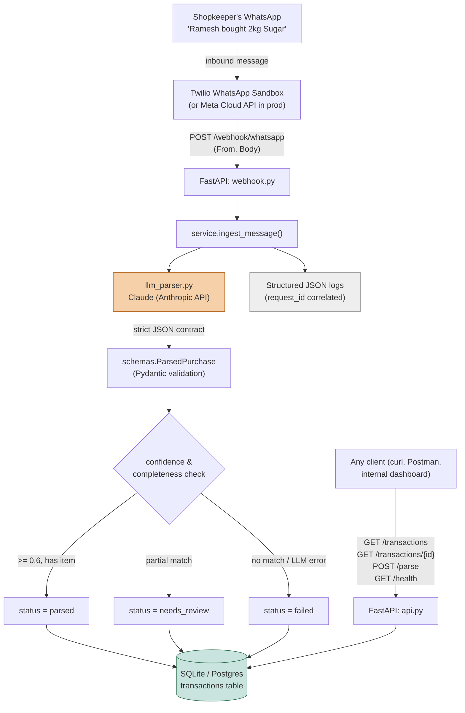

# Architecture

## Flow, step by step

1. **Ingestion** — A shop owner sends a WhatsApp message. Twilio's WhatsApp Sandbox forwards it as a form-encoded webhook (`From`, `Body`) to `POST /webhook/whatsapp`. (Meta's WhatsApp Cloud API is a drop-in alternative for production — see README.)
2. **Shared pipeline** — Both the webhook and the manual `POST /parse` endpoint call the same `ingest_message()` function, so behavior never diverges between "real WhatsApp" and "test via curl."
3. **LLM parsing** — The raw text is sent to Claude with a strict system prompt that mandates a fixed JSON shape (`customer_name`, `action`, `item`, `quantity`, `unit`, `confidence`). No prose, no markdown — just the object.
4. **Validation** — The JSON is parsed and validated against a Pydantic schema (`ParsedPurchase`). Malformed or non-JSON output never crashes the request; it degrades to a zero-confidence result instead.
5. **Confidence routing** — Based on confidence and field completeness, the record is tagged `parsed`, `needs_review`, or `failed` — nothing is silently dropped, everything is queryable and auditable later.
6. **Persistence** — The structured fields *and* the original raw message are stored (SQLite locally, Postgres in production via one env var).
7. **Logging** — Every stage emits a structured JSON log line tagged with a `request_id`, so a single WhatsApp message's journey can be traced end-to-end in your log aggregator.
8. **API exposure** — `GET /transactions` (with filters), `GET /transactions/{id}`, and `GET /health` expose the data for dashboards, reconciliation, or other services.
