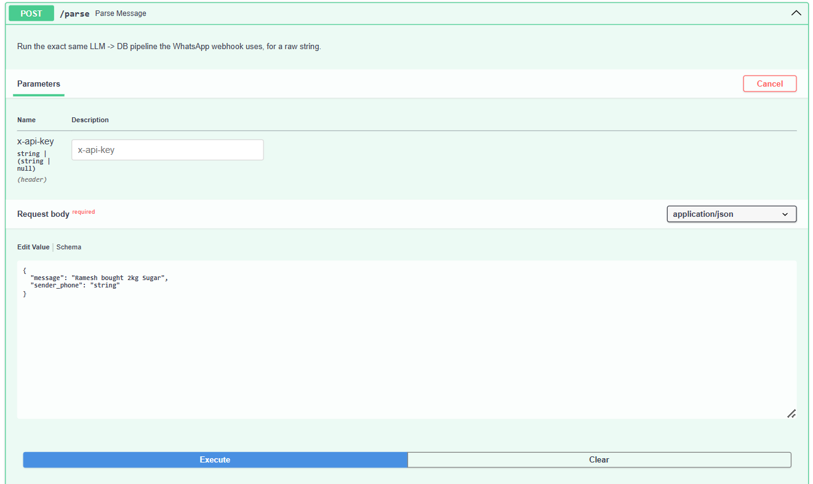
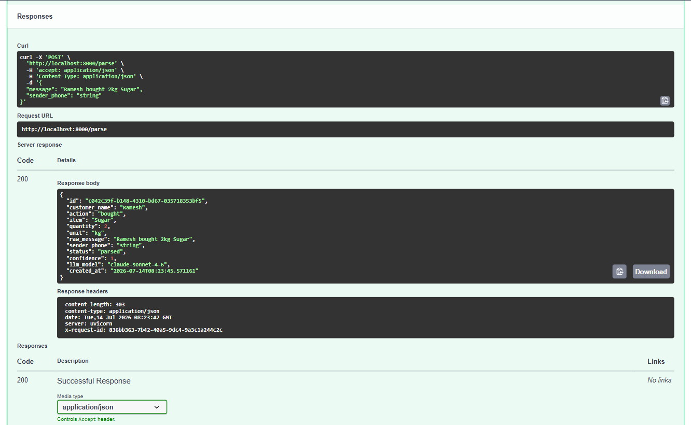
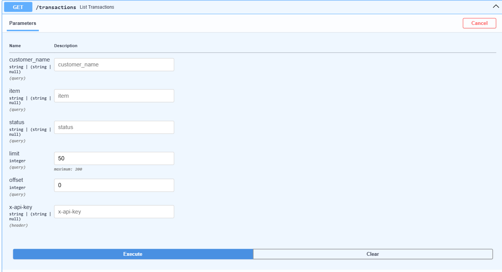
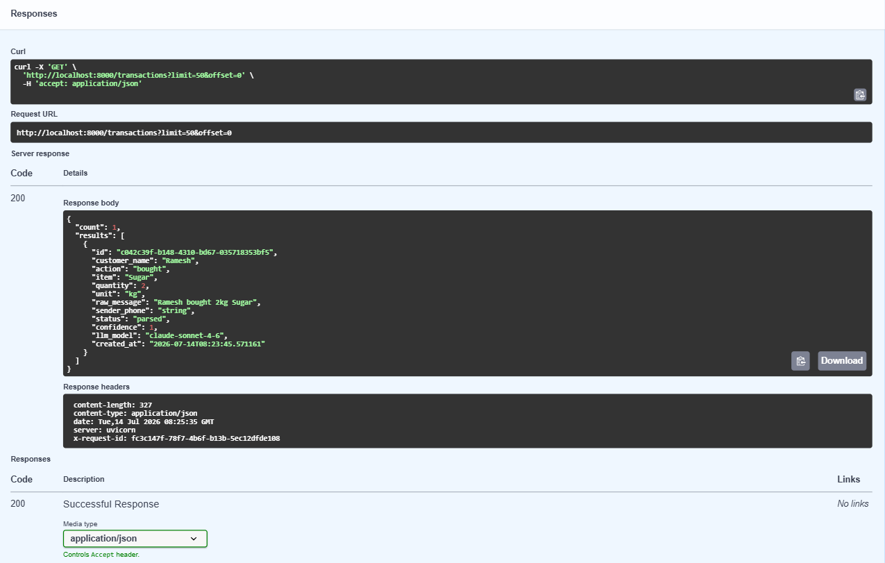
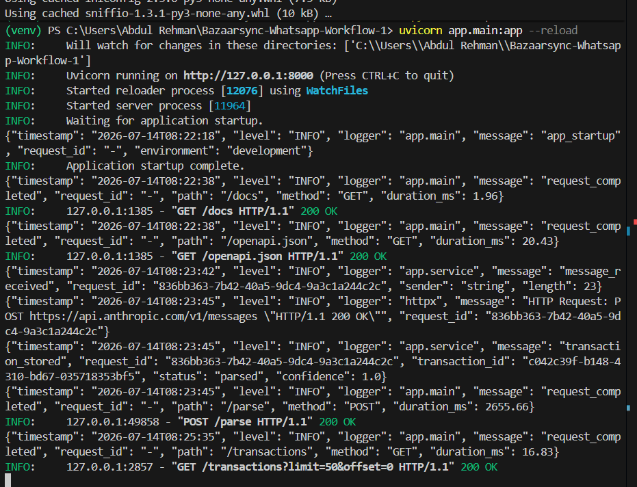
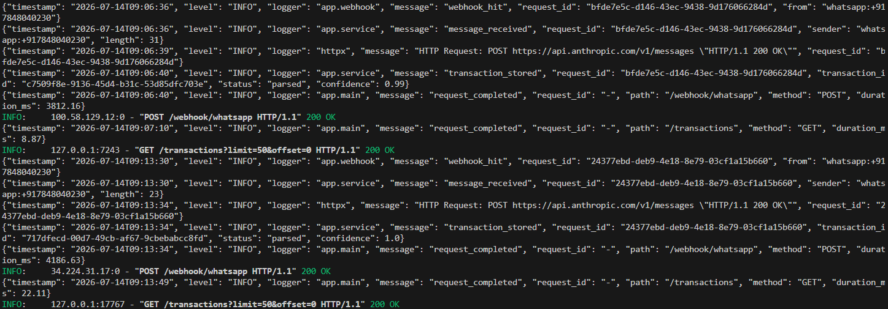

# Testing & verification

This document is the evidence trail for the trial task: the full pipeline (WhatsApp message → Claude → structured JSON → database → API) tested and working, both manually and with real WhatsApp messages over Twilio.

Two test passes are documented below:
1. **Manual API tests** — exercising the pipeline directly through the interactive `/docs` (Swagger UI), with no WhatsApp involved. This isolates and proves the core logic: LLM parsing, validation, and persistence.
2. **Real WhatsApp flow** — the same pipeline triggered by an actual WhatsApp message, routed through Twilio's WhatsApp Sandbox and ngrok into the running server.

---

## 1. Manual API tests

### 1.1 — `POST /parse` request
Sending the exact message from the trial brief, `"Ramesh bought 2kg Sugar"`, directly to the parsing endpoint via Swagger UI's "Try it out."

### 1.2 — `POST /parse` response
Claude parses the message and returns fully structured JSON: `customer_name: "Ramesh"`, `action: "bought"`, `item: "Sugar"`, `quantity: 2`, `unit: "kg"`, with a `confidence` of `1.0` and `status: "parsed"`. The record is assigned a UUID and timestamped — this response also confirms it was written to the database in the same request.

### 1.3 — `GET /transactions` request
Querying the stored transactions back out through the listing endpoint.

### 1.4 — `GET /transactions` response
The record created in step 1.2 is returned unchanged — confirming persistence, not just an in-memory response.

### 1.5 — Server logs for the manual test
Structured JSON logs from the running server, showing the full request lifecycle for the calls above: `message_received` → the outbound call to `api.anthropic.com/v1/messages` (`200 OK`) → `transaction_stored` → `request_completed`, each line correlated by `request_id`.

---

## 2. Real WhatsApp flow (Twilio Sandbox → ngrok → this service)

Setup used for this pass: a live FastAPI server tunneled to the internet via ngrok, with the tunnel URL registered as the webhook in Twilio's WhatsApp Sandbox (`When a message comes in` → `https://<ngrok-url>/webhook/whatsapp`).

### 2.1 — WhatsApp conversation
Two real messages sent from a personal WhatsApp account to the Twilio Sandbox number, each immediately answered by the bot's auto-reply confirming receipt:
- `"Sita returned 1 packet biscuits"` → `BazaarSync: recorded.`
- `"Ramesh bought 2kg Sugar"` → `BazaarSync: recorded.`

### 2.2 — Server logs for the WhatsApp webhook
The same two messages hitting the server from Twilio's infrastructure (note the external IPs, not `127.0.0.1`): `webhook_hit` → `message_received` → Claude call (`200 OK`) → `transaction_stored` with `status: parsed` → `request_completed` on `POST /webhook/whatsapp`, for both messages.

### 2.3 — `GET /transactions` after the WhatsApp test
Both WhatsApp-originated records now in the database, each with a real `sender_phone` (`whatsapp:+91...`) instead of a manually-typed test value — proof this data came from the actual webhook, not another manual `/parse` call.

---

## Summary

| Requirement from the brief | Verified by |
|---|---|
| Parsed using an LLM | 1.2, 2.2 (Claude API calls, `200 OK`) |
| Converted into structured JSON | 1.2, 1.4, 2.3 |
| Stored in a database | 1.4, 2.3 |
| Logged properly | 1.5, 2.2 (structured JSON logs, request-id correlated) |
| Exposed through a simple API | 1.1–1.4 |
| Works with real WhatsApp messages | 2.1–2.3 |
